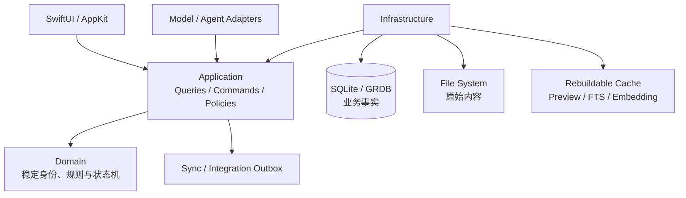

# Verso

> 面向设计师、工程师、投资人等专业人士的本地优先知识工作台。

Verso 帮助用户把日常积累的资料与判断，经过理解、沉淀、共创与复核，转化为有来源、可验证、可持续迭代、可发布的知识资产。

它不是一个把文件上传后交给 AI 总结的聊天工具，也不是另一个只能收藏资料的文件管理器。Verso 希望在本地建立一条完整的专业知识生产链：

```text
搜集资料
    → 理解与建立引用
    → 沉淀概念、原则、框架与判断
    → 提交 Contribution
    → 用户与 AI 共同复核
    → 合并到 Output Mainline
    → 冻结为可验证的 BundleVersion
    → 导出 OKF / 连接 Experty 发布
```

Prologue 仅为项目早期代号；产品和应用的正式名称是 **Verso**。

## 为谁而设计

Verso 面向需要长期积累上下文、形成独立判断并反复复用知识的专业工作者，例如：

- 设计师：管理研究资料、设计依据、案例、原则和方案演进。
- 工程师：连接技术资料、代码上下文、架构决策和项目产出。
- 投资人和研究者：保存来源、论点、证据、反证、判断与研究报告。
- 创作者和顾问：把分散素材逐步转化为文章、课程、方法论和可交付资产。

## 产品体验

Verso 的主工作界面围绕三个区域组织：

```text
┌──────────────────┬────────────────────────────┬──────────────────┐
│ Library          │ Content                    │ Assistant        │
│                  │                            │                  │
│ Workspace        │ 文件预览 / Markdown 编辑   │ AI 对话          │
│ 逻辑文件树       │ 内容选区 / 引用 / Diff     │ 上下文 / 提案    │
│ 搜索与组织       │ Output / Contribution      │ Review / Approval│
└──────────────────┴────────────────────────────┴──────────────────┘
```

- **左侧 Library**：组织 Workspace、来源、文档、素材和未来的知识对象。
- **中央 Content**：预览 PDF、图片、音视频等文件，编辑 Markdown，并查看结构化产出与变更。
- **右侧 Assistant**：围绕当前文件、选区和显式引用与 AI 对话；AI 可以研究、解释和提出修改，但不能绕过用户直接改变正式产出。

预览与 AI 内容理解是两条独立管线：Quick Look、PDFKit 和 AVFoundation 负责呈现；Content Extractor 与 Context Builder 负责向搜索和 AI 提供有来源、带 revision 的上下文。

## 核心产品原则

### 本地优先，而不是网络优先

原始文件和 Workspace 业务事实首先保存在用户设备上。没有账号、AI、同步服务或 Experty，用户仍然可以打开、编辑、导出和恢复自己的内容。未来同步只复制版本化事实，不直接同步正在使用的 SQLite 数据库。

### 来源与血缘是知识的一部分

Verso 不只保存最终文本，还记录来源、引用关系、作者、内容 revision、AI 参与和复核结果。发布后的知识应当可以反向追踪到构成它的资料与判断。

### AI 是协作者，不是事实所有者

AI 与用户共用同一套 Typed Command、权限策略和审计边界。AI 可以创建草稿、Contribution 和 Review Finding，但不能直接修改 Output Mainline、批准自己的修改、冻结 BundleVersion 或自行发布。

### 正式产出需要经过复核与合并

Verso 借鉴软件工程中的 PR / CI / Merge：

```text
工作草稿
    → Contribution
    → 不可变 ChangeSet
    → 确定性 Validation + 人 / AI Review
    → 用户 Approval
    → Merge 到 Output Mainline
```

这不是在知识工作中复制 Git，而是让重要产出保留明确的修改意图、证据、复核记录和版本边界。

### 知识可以成为可携带资产

Verso 可以独立完成资料收集、知识沉淀、产出和复用。未来连接 Experty 后，用户可以把确定的 OutputRevision 与 KnowledgeConcept 冻结为不可变 BundleVersion，导出为 OKF Artifact，再进行发布、分发、许可和交易。Experty 不是访问私人 Workspace 的前置条件。

## 当前状态

Verso 仍处于早期开发阶段。当前重点是先建立可长期维护、可迁移、可恢复的底层，再逐步开放完整产品界面。

### 当前 App 已可操作

- 创建、打开、切换、关闭和重新打开本地 Workspace。
- 导入文件或文件夹并浏览磁盘文件树。
- 创建和编辑 UTF-8 Markdown 文档。
- 使用 Apple Quick Look 预览系统支持的 PDF、图片、音视频和其他文件。
- 在数据库异常时进入只读恢复流程并从备份恢复。

### 已完成但尚未全部接入 UI

- SQLite/GRDB 迁移、备份、恢复、幂等 Command、事务 Outbox 与诊断基础设施。
- 同步兼容的稳定身份、revision、tombstone、`OperationID` 与数据分类。
- Source、KnowledgeConcept、知识血缘和 Publication Policy 领域契约。
- Output Mainline、Contribution、ChangeSet、Validation、Review、Approval 与原子 Merge。
- 不可变 BundleVersion，以及确定性的 OKF Artifact 构建、校验和重新导入。

### 尚未作为完整产品能力提供

- 逻辑文件树、全文搜索、引用与反向链接。
- 完整 Markdown 编辑器、历史版本和 Diff UI。
- 右侧 AI 对话、Context Builder 与受控 Agent。
- Bundle Studio 与 Experty 发布入口。
- CloudKit、iCloud Drive、NAS 或其他真实多设备同步。
- iOS 客户端、多人协作、插件市场和实时 CRDT。

具体完成度、限制和验收结果以 [产品能力更新日志](docs/product/PRODUCT_CHANGELOG.md) 为准。

## 技术架构

Verso 采用原生、本地优先的模块化单体：



已锁定的工程基线：

- Swift 6、SwiftUI，必要处使用 AppKit。
- 最低部署目标 macOS 15。
- 模块化单体，不采用微服务拆分客户端。
- SQLite/GRDB 保存业务事实；原始文件保留在文件系统。
- 虚拟文件树与真实路径分离，路径不作为业务身份。
- 搜索、缩略图、Embedding 等派生数据必须可删除、可重建。
- UI 和 Agent 都不能直接写数据库或任意文件，正式修改统一经过 Command Bus。
- 文件写入、数据库迁移、Merge 和 Agent 修改必须具备中断恢复与审计边界。
- Markdown 原文是可携带的内容事实；编辑器是可替换的呈现引擎。

## 路线图

| 阶段 | 目标 |
|---|---|
| Phase 0 | 工程、可靠性、同步兼容和知识资产领域骨架 |
| Phase 1 | Workspace、逻辑文件树与 Markdown |
| Phase 2 | 文件预览、媒体处理与全文搜索 |
| Phase 3 | AI 共创、Context Builder 与受控 Agent |
| Phase 4 | 本地 Bundle Studio 与 OKF 构建 |
| Phase 5 | Experty Creator Bridge |
| Phase 6 | 时间与日程管理 |
| Phase 7 | 上线、恢复演练、性能与隐私验收 |

完整范围和阶段退出标准见 [ROADMAP](docs/product/ROADMAP.md)。

## 开始开发

环境基线：

- Xcode 26.5 或更高的稳定 Xcode 26 版本
- Swift 6 language mode 与完整并发检查
- macOS 15 或更高版本

请始终从 `Verso.xcworkspace` 打开工程：

```sh
open Verso.xcworkspace
```

提交工程改动前运行：

```sh
bash Scripts/check_dependencies.sh
bash Scripts/check_project_format.sh
swift test --package-path Packages/VersoCore
```

命令行构建：

```sh
xcodebuild \
  -workspace Verso.xcworkspace \
  -scheme Verso \
  -configuration Debug \
  -destination 'platform=macOS' \
  CODE_SIGNING_ALLOWED=NO \
  build
```

更多工具链、签名、Sandbox、双机开发和 Workspace 生命周期说明见 [DEVELOPMENT](DEVELOPMENT.md)。

## 文档导航

- [产品路线图](docs/product/ROADMAP.md)：阶段计划、范围和验收标准
- [产品能力更新日志](docs/product/PRODUCT_CHANGELOG.md)：当前真正可用、已接线和未完成的能力
- [系统架构](docs/architecture/ARCHITECTURE.md)：模块边界、数据流、可靠性与安全策略
- [核心数据模型](docs/architecture/DATA_MODEL.md)：Workspace、Source、Concept、Output、Contribution、Bundle 与 Agent
- [架构决策记录](docs/architecture/decisions/README.md)：长期保留关键决策及其原因
- [Phase 0 工程说明](docs/engineering/PHASE0.md)：可靠性骨架、测试与剩余事项
- [同步兼容基线](docs/engineering/SYNC_BASELINE.md)：可同步事实、本地凭据与传输边界
