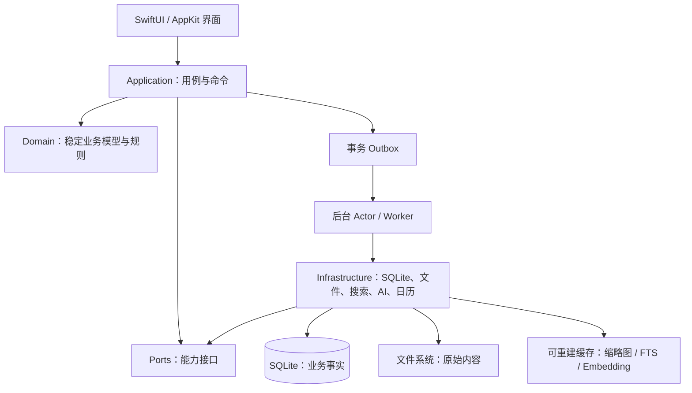
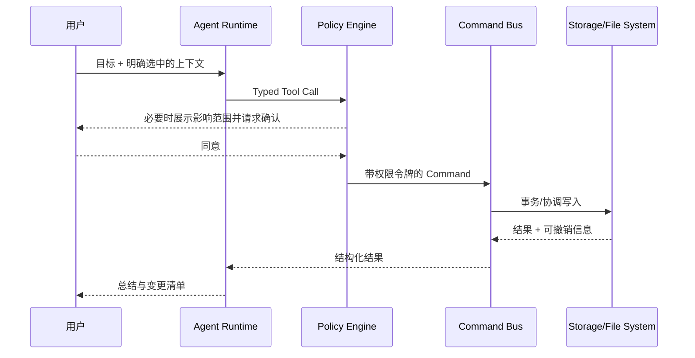

# Verso 系统架构基线

状态：Accepted
版本：0.1
日期：2026-07-22

## 1. 架构目标

Verso 的底层设计优先保证五件事：

1. 用户原始文件不因应用崩溃、升级或 AI 操作而损坏。
2. 任何索引、缩略图、Embedding 和 AI 产物都可以重建。
3. 数据库可以逐版本迁移、验证、备份和恢复。
4. 每个 AI 写操作都有明确权限、影响范围、执行记录和撤销路径。
5. 功能可以按模块独立演进，但首版仍保持一个进程、一个仓库和一种部署方式。

这不是“把所有未来功能一次设计完”。稳健的含义是先锁定难以逆转的边界，把容易变化的实现封装在边界之后。

## 2. 总体形态

采用本地优先的模块化单体：UI、业务规则、文件访问、数据库、搜索和 AI 在同一个 macOS App 中运行，但只能通过显式接口互相调用。



依赖方向只能向内：

```text
Features/UI -> Application -> Domain
Infrastructure --------^  （实现 Application 所需的接口）
```

Domain 不导入 SwiftUI、GRDB、EventKit、OpenAI SDK、文件 URL 或任何具体编辑器。这条规则是长期可维护性的核心。

## 3. 模块边界

建议使用一个 Xcode Workspace、一个 App target，加若干本地 Swift Package。模块先按变化原因拆分，不按每个页面拆分。

```text
VersoApp
├── AppShell                 窗口、菜单、命令、依赖装配、路由
├── DesignSystem             颜色、排版、组件、无业务状态
├── FeatureLibrary           逻辑文件树、导入、引用、标签
├── FeatureEditor            Markdown 编辑、版本、引用插入
├── FeaturePreview           图片/PDF/音视频/通用预览
├── FeatureTimeline          任务、时间块、外部日历映射
├── FeatureAssistant         对话、上下文选择、Agent 运行界面
├── VersoDomain           值对象、实体、业务规则、领域错误
├── VersoApplication      Commands、Queries、Use Cases、Policies
├── VersoBundleFormat     纯 OKF/Artifact 导入、导出、校验与摘要
├── VersoPersistence      SQLite/GRDB、迁移、备份、Outbox
├── VersoFileSystem       Bookmark、协调读写、文件观察、哈希
├── VersoSearch           FTS、索引任务、排序
├── VersoAI               模型网关、工具执行器、流式响应
├── VersoCalendar         EventKit 适配器
└── VersoObservability    本地日志、性能指标、诊断导出
```

初期可以把 Feature 模块保留在 App target 内，等团队或编译时间证明有必要再拆成 Package。Domain、Application、Persistence、FileSystem 应从第一天保持清晰边界。

`VersoBundleFormat` 只依赖 `VersoDomain`。它不得导入 GRDB、UI、文件权限、网络或 provider SDK；Persistence 负责读取已授权文件和业务事实，再把确定输入交给格式模块。

### 3.1 命令与查询

- Query 只读，返回 UI 专用的轻量 View State，不返回可变数据库对象。
- Command 表达一次业务意图，例如 `ImportAsset`、`MoveNode`、`SaveDocumentRevision`、`ScheduleTask`。
- Command Handler 负责权限校验、事务、领域事件和可撤销记录。
- UI 不直接写数据库，Agent 工具也不直接写数据库或文件。

这使人类点击和 Agent 操作复用同一套业务规则。

## 4. 数据所有权与存储

### 4.1 四类数据必须分开

| 类别 | 示例 | 事实来源 | 是否可重建 |
|---|---|---|---|
| 原始内容 | 图片、视频、PDF、外部 Markdown | 文件系统 | 否 |
| 业务事实 | 节点树、任务、对话、引用、权限决定 | SQLite | 否 |
| 派生数据 | FTS、Embedding、缩略图、波形 | Cache / 派生表 | 是 |
| 临时状态 | 选中项、草稿光标、流式 token | 内存或恢复状态 | 是 |

任何“清理缓存”操作都不得触碰前两类数据。

### 4.2 工作空间目录

应用私有数据使用 Application Support；缓存使用 Caches。示意结构如下：

```text
Application Support/Verso/
├── catalog.sqlite                 全局工作空间目录与设置
├── Workspaces/<workspace-id>/
│   ├── workspace.sqlite           该工作空间的业务事实
│   ├── ManagedFiles/              用户选择“复制进 Verso”的内容
│   ├── Documents/                 应用创建的 Markdown 原文
│   ├── Backups/                   迁移前和周期性备份
│   └── Recovery/                  未完成写入与恢复材料
└── Diagnostics/                   用户主动导出的诊断包

Caches/Verso/<workspace-id>/
├── Thumbnails/
├── PreviewArtifacts/
├── Search/
└── Embeddings/
```

SQLite 开启外键约束并使用 WAL。备份时必须通过 SQLite 的一致性备份机制或在关闭连接后把数据库、`-wal`、`-shm` 作为整体处理；不能在数据库打开时只复制主文件。SQLite 官方明确说明 WAL 是持久状态的一部分。

### 4.3 两种文件接入方式

1. **Managed**：复制到工作空间的 `ManagedFiles`。应用负责生命周期，默认用于拖入后希望长期归档的内容。
2. **Linked**：保留原位置，只存安全作用域 Bookmark 和文件身份信息。适合大型素材库或不能移动的目录。

逻辑节点永远使用稳定 `NodeID`，不能把路径当主键。路径会因重命名、移动、卷挂载和 iCloud 状态变化而改变。

Linked 文件访问流程固定为：解析 Bookmark → 检查是否 stale → 开启 security-scoped access → 使用 `NSFileCoordinator` 在后台队列读写 → 结束 access。Apple 要求持久访问使用安全作用域 Bookmark，并在解析后显式开始和结束访问。

### 4.4 虚拟文件系统的含义

首版 VFS 是 `Node(parentID, position)` 形成的逻辑树：

- Folder 节点只负责组织，不要求磁盘上存在同名文件夹。
- 同一个 Asset 可以被多个 Node 引用，不复制原文件。
- 重命名 Node 默认只改展示名，不改 Linked 文件名。
- 删除 Node 默认移除引用；只有明确的“删除原文件”操作才会触碰文件系统。
- 循环引用由数据库约束与命令层共同阻止。

不要在首版使用 File Provider 模拟这棵树。Apple 将 Replicated File Provider 定位为远端存储与本地副本同步，并由系统管理副本；这是未来“同步到 Finder”的独立子系统，不是应用内逻辑树的基础。

## 5. 一致性、并发与后台任务

### 5.1 并发模型

- Swift 6 严格并发检查从第一天开启。
- UI 状态限定在 `@MainActor`。
- 文件协调、索引、模型请求、缩略图生成分别由独立 actor 管理可变状态。
- 数据库通过 GRDB `DatabasePool` 管理并发读取和串行写入；调用者不持有连接。
- 文件 I/O、数据库迁移、哈希和媒体解析不得运行在主线程。
- 长任务必须支持取消、进度、幂等重试和应用重启后的恢复。

Swift 6 严格检查能在编译阶段发现一类数据竞争；Apple 也建议文件访问使用协调器并放到异步队列，避免主线程卡顿和跨进程冲突。

### 5.2 事务 Outbox，而非完整事件溯源

一次命令在同一个数据库事务中：

1. 更新业务表。
2. 写入 `domain_events` / `outbox_jobs`。
3. 写入可选的 `operation_journal`。

事务提交后，后台 worker 才开始更新 FTS、生成缩略图或请求 Embedding。worker 通过唯一 `jobID` 和幂等键安全重试。

不采用完整 Event Sourcing。它会把每次模型变化变成事件兼容问题，首版收益不足。`operation_journal` 只服务审计、恢复和有限撤销，业务表仍是当前事实。

设备一致性与外部业务集成使用两个独立 Outbox：

- Sync Outbox 携带可同步事实、base revision 与 revision，不选择 CloudKit、云盘或 NAS。
- Integration Outbox 携带版本化业务事件信封。Phase 0 只写入 `BundleBuilt` 与必要的 `OutputMerged` 事实，不连接 Experty 或网络消费者。

`MergeContribution` 是关键原子边界：新的 OutputRevision、Mainline 指针、MergeRecord、Contribution 状态、applied operation、Sync Outbox 和 Integration Outbox 必须一起提交或一起回滚。

### 5.3 原子文件写入

应用创建或修改文件时遵循：

1. 在同卷临时位置写入完整内容。
2. `fsync`/关闭句柄后进行原子替换。
3. 使用 `NSFileCoordinator` 通知其他进程与 presenter。
4. 成功后提交数据库中的新 revision；失败则保留旧 revision。

跨数据库与文件系统无法形成真正的单一 ACID 事务，因此需要带状态的 operation：`prepared → fileCommitted → databaseCommitted → completed`。启动恢复器负责完成或回滚中断步骤。

## 6. 各能力的实现边界

### 6.1 Markdown 编辑器

- `.md` 原文是内容事实，不把富文本 AST 作为唯一存储格式。
- 编辑器通过 `EditorEngine` 接口接入；首版可选 CodeMirror 6 + WKWebView。
- WebView 只负责编辑与渲染，不访问数据库、文件系统、Keychain 或网络。
- Swift 与 JavaScript 的消息协议必须有版本、结构化类型、消息大小上限和超时。
- 自动保存生成 revision；连续输入可以合并 revision，显式 AI 改写必须单独形成 revision。
- 引用使用稳定 ID 语法，渲染时解析；导出时可转换为相对路径或标准 Markdown 链接。

这样可在未来替换为 TextKit 2 或其他编辑器，而不迁移用户内容。

### 6.2 多媒体预览

采用逐级降级：

1. 列表缩略图使用 Quick Look Thumbnailing。
2. 通用查看使用 Quick Look。
3. 需要深度交互时才使用 PDFKit、AVFoundation、ImageIO 等专用框架。
4. 未知格式显示元数据、Finder 定位和外部打开操作。

预览产生的所有内容都进入 Caches。Quick Look 官方支持常见图片、文档、PDF、音视频等格式，适合作为覆盖面优先的第一层。

### 6.3 搜索与检索

首版：

- SQLite FTS5 负责文件名、Markdown、对话、任务的全文搜索。
- 元数据过滤、时间范围和标签使用普通索引列。
- 中文搜索在真实语料上验证 tokenizer；不要默认 FTS5 的 token 结果已满足中文体验。
- 索引表只保存可重建数据，并记录 `sourceRevision`。

后续：

- Embedding 由独立 `EmbeddingProvider` 生成，按内容哈希和模型版本缓存。
- 每条向量记录 `modelID`、`dimension`、`contentHash`、`createdAt`。
- 模型切换通过后台重建完成，不能迁移或覆盖业务事实。
- 数据规模没有证明需要前，不引入独立向量数据库。

### 6.4 时间与日历

Verso 自身拥有 `Task` 和 `TimeBlock`；macOS Calendar 由 EventKit adapter 提供外部镜像。

- 外部日历事件用 `ExternalCalendarReference` 关联，不能把 EventKit ID 当内部主键。
- 所有日期持久化为 UTC instant，并保存原始时区标识；全天事件单独建模，不能伪装为午夜时间点。
- 重复规则保留结构化表达，不能只展开为大量实例。
- 首版先做单向读取或显式导出；双向同步要有冲突策略后再开启。

### 6.5 AI 与 Agent

模型只负责提出结构化意图，不获得数据库句柄或任意文件系统访问。标准执行链：



权限等级：

| 等级 | 操作 | 默认策略 |
|---|---|---|
| R0 | 读取当前已授权上下文 | 可自动执行并记录 |
| R1 | 创建应用内草稿、标签、建议 | 可按会话授权 |
| R2 | 修改/移动/删除应用内内容，写外部日历 | 每次展示 diff 或影响范围 |
| R3 | 删除原文件、批量覆盖、对外发送、执行程序 | 首版禁用或强制逐次确认 |

安全要求：

- 工具使用 JSON Schema/Swift 类型定义，参数严格校验。
- 用户文件、网页和模型输出全部视为不可信输入；其中的文字不能提升权限。
- 上下文构建器记录每段内容的来源、大小、敏感等级和裁剪原因。
- API Key 只存 Keychain；日志默认不记录正文、Prompt、Token 或文件路径。
- 每次 run 保存模型、工具调用、用户授权、状态、耗时和成本，但正文采用可配置保留策略。
- 写操作必须走与 UI 相同的 Command Bus，因此测试一次即可覆盖人和 Agent 两种入口。

## 7. 数据库迁移、备份与恢复

- 每个 schema 版本只允许向前迁移，迁移文件提交后不可修改。
- 发布包必须能从所有仍受支持的历史版本逐级迁移到当前版本。
- 迁移前生成一致性备份并检查可用磁盘空间。
- 迁移在事务中执行；涉及大数据重建时使用可恢复的分阶段迁移。
- 启动时运行轻量完整性检查；诊断工具可运行 `foreign_key_check` 与更完整检查。
- 定期验证“备份真的能恢复”，而不仅是验证“备份文件存在”。
- FTS、Embedding 和缩略图不进入关键恢复路径，恢复后按需重建。

## 8. 可观测性与隐私

使用 Apple Unified Logging 的结构化日志，并明确 privacy 标记。最少记录：

- 启动阶段与耗时
- 数据库迁移版本与结果
- 后台任务状态、重试次数、错误类别
- Agent run 与 tool call 的 ID、耗时、状态、权限等级
- 文件访问错误的类别，不默认记录完整路径

诊断包必须由用户主动导出，导出前列出内容并允许排除文档正文、对话和文件名。遥测默认仅包含匿名技术指标；产品分析与崩溃上报都需要单独开关和隐私说明。

## 9. 测试与质量门槛

### 必须自动化

- Domain 规则单元测试
- Command 权限和事务测试
- 每一版数据库迁移的 fixture 测试
- 文件中断恢复、Bookmark stale、外部移动/删除测试
- Agent 工具 schema、权限升级和 Prompt Injection 回归测试
- FTS 重建与源 revision 一致性测试
- UI 关键路径和无障碍标识测试

### 发布门槛

- 冷启动不依赖网络、模型服务、Embedding 或索引完成。
- 拔网、模型限流、外部磁盘离线时核心编辑仍可用。
- 强制终止发生在保存/导入/迁移各阶段时，重新启动不丢失已确认内容。
- 10 万节点工作空间的树形浏览采用分页/惰性加载，滚动不触发同步磁盘 I/O。
- 所有破坏性 Agent 工具都有权限测试和人工验收记录。
- 可从上一正式版备份恢复，并通过自动完整性检查。

## 10. 同步兼容，但不提前实现同步

首版模型预留：稳定 UUID、`createdAt`、`modifiedAt`、revision、tombstone、操作幂等键和可选 `deviceID`。这足以避免未来同步时重做身份体系。

首版不预先实现 CRDT、云端真相源或多主冲突算法。同步设计必须等以下问题明确：

- 同步的是 Managed 文件、Linked 引用，还是两者？
- 数据是否端到端加密？服务端能否建立索引？
- Markdown、节点移动、日历和 Agent 操作各自采用什么冲突语义？
- 产品是否需要 Finder 暴露与按需下载？

## 11. 明确延后

- CloudKit/自建云同步
- File Provider 与 Finder Sidebar
- 多人实时协作与 CRDT
- 插件 SDK 和第三方任意代码执行
- 多 Agent 自主协作
- 独立向量数据库
- 跨平台客户端

延后不代表忽略：接口允许替换，数据身份保持稳定，但首版不承担这些系统的故障面。

## 12. 官方依据与实现参考

- [Apple：访问 macOS App Sandbox 中的文件](https://developer.apple.com/documentation/security/accessing-files-from-the-macos-app-sandbox)
- [Apple：NSFileCoordinator](https://developer.apple.com/documentation/foundation/nsfilecoordinator)
- [Apple：改进文件系统访问的性能与稳定性](https://developer.apple.com/documentation/foundation/improving-performance-and-stability-when-accessing-the-file-system)
- [Apple：Quick Look](https://developer.apple.com/documentation/quicklook)
- [Apple：Quick Look Thumbnailing](https://developer.apple.com/documentation/quicklookthumbnailing)
- [Apple：Replicated File Provider extension](https://developer.apple.com/documentation/fileprovider/replicated-file-provider-extension)
- [Apple：在 Swift 6 中采用严格并发](https://developer.apple.com/documentation/Swift/AdoptingSwift6)
- [SQLite：Write-Ahead Logging](https://sqlite.org/wal.html)
- [GRDB：Swift SQLite toolkit](https://github.com/groue/GRDB.swift)
