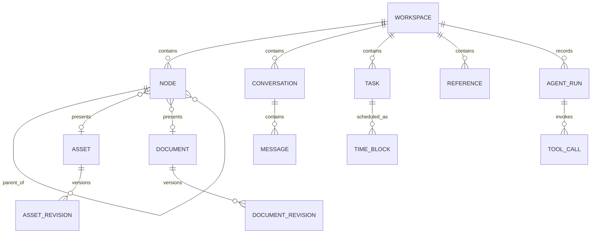

# 核心数据模型

状态：Draft
目标：在写 UI 和数据库表之前，先统一产品语言、身份和生命周期。

## 1. 聚合关系



这里的实体是业务概念，不等同于数据库表。持久化层可以拆表、合表或添加派生表，但不能让存储细节反向污染业务模型。

## 2. 稳定身份规则

- 所有业务实体使用应用生成的 UUIDv7/UUID 作为身份。
- 文件路径、文件名、内容哈希、数据库 rowid、EventKit identifier 都不是内部身份。
- `contentHash` 用于变化检测、缓存和去重建议；两份内容相同的文件仍可拥有不同 Asset 身份。
- 用户可见名称与物理文件名分开。
- 外部系统标识符存放在单独 reference 中，并允许失效和重新绑定。

## 3. 核心实体

### Workspace

一个可独立备份、迁移、关闭和未来同步的边界。

```text
Workspace
- id
- name
- schemaVersion
- createdAt / modifiedAt
- defaultTimeZoneID
- rootNodeID
- lifecycleState
```

一个 Workspace 拥有自己的数据库与 Managed 文件目录。跨 Workspace 引用首版不支持，避免生命周期和同步边界不清。

### Node

逻辑文件树中的展示节点。

```text
Node
- id
- workspaceID
- parentID?
- kind: folder | asset | document | smartCollection
- targetID?
- displayName
- rank
- createdAt / modifiedAt / deletedAt?
```

约束：

- 根节点只有一个且不可删除。
- `parentID` 必须属于同一 Workspace。
- 移动操作不能形成祖先循环。
- `rank` 使用可在相邻节点间插入的排序方案，避免每次拖拽重写整棵树。
- 删除先产生 tombstone；真正清理由保留策略执行。

### Asset

指向一份非 Markdown 原始内容。

```text
Asset
- id
- workspaceID
- storageKind: managed | linked
- locatorID
- mediaType / utType
- byteSize
- fingerprint
- availability: available | offline | missing | unauthorized
- createdAt / modifiedAt
```

`FileLocator` 是基础设施类型：Managed 使用工作空间内相对路径；Linked 使用加密/受保护的 Bookmark Data、最后已知路径提示、volume/file resource identifier。Domain 只看 `AssetID` 与 availability，不接触 URL。

### Document 与 DocumentRevision

Document 是稳定身份，Revision 是不可变快照。

```text
Document
- id
- workspaceID
- currentRevisionID
- title
- format: markdown
- createdAt / modifiedAt / deletedAt?

DocumentRevision
- id
- documentID
- parentRevisionID?
- contentRelativePath
- contentHash
- authorKind: user | agent | import | recovery
- authorRunID?
- createdAt
```

大型文档原文存文件，revision 元数据存数据库。保存频率与 revision 保留频率分开：可以高频原子保存，但将连续键入压缩为较少的历史版本。

### Reference

连接任意两个业务实体，供反向链接、上下文构建和“被哪些内容使用”查询。

```text
Reference
- id
- workspaceID
- sourceKind / sourceID
- targetKind / targetID
- relation: embeds | mentions | derivedFrom | attachedTo | blocks
- sourceRevisionID?
- anchorJSON?
- createdAt / deletedAt?
```

`anchorJSON` 有版本号，用于保存 Markdown 范围、PDF 页码、视频时间段等不同锚点。它是可失效的定位提示，不改变目标身份。

### Conversation 与 Message

```text
Conversation
- id
- workspaceID
- title
- createdAt / modifiedAt / archivedAt?

Message
- id
- conversationID
- role: user | assistant | tool | system
- contentPartsJSON
- status: streaming | completed | failed | cancelled
- modelID?
- createdAt
```

消息内容采用有版本的 parts：text、asset reference、document reference、tool result、citation。不要把所有内容压成一个字符串。

### Task、TimeBlock 与外部日历

```text
Task
- id
- workspaceID
- title
- notesDocumentID?
- status
- priority
- dueInstant?
- dueTimeZoneID?
- createdAt / modifiedAt / completedAt?

TimeBlock
- id
- taskID?
- title
- startInstant / endInstant
- timeZoneID
- allDay
- recurrenceRuleJSON?
- externalReferenceID?
```

Task 表达“要完成什么”，TimeBlock 表达“何时占用时间”。两者不能合成一个 Event，否则未排期任务、跨时区和重复事件都会变得含混。

### AgentRun 与 ToolCall

```text
AgentRun
- id
- workspaceID
- conversationID?
- goal
- modelID
- contextManifestJSON
- status
- startedAt / endedAt?
- usageJSON?
- errorCategory?

ToolCall
- id
- runID
- toolName / toolVersion
- permissionLevel
- argumentsDigest
- approvalID?
- status
- operationID?
- startedAt / endedAt?
```

敏感正文不必写入审计表；使用 digest 和 source IDs 可以证明执行对象，同时遵循用户的内容保留设置。

### Actor、SourceRecord 与 KnowledgeConcept

`Actor` 是与账号、邮箱、设备和模型名称解耦的作者身份；本地 `CreatorProfile` 只保存展示资料，未来外部账号通过 reference 绑定。

```text
Actor
- id / workspaceID
- kind: person | agent | organization | importer | recovery
- displayName
- createdAt / modifiedAt / revision

SourceRecord
- id / workspaceID
- kind: web | book | video | file | interview | original
- canonicalURL? / title / originalCreator?
- capturedAt / contentHash?
- sourceAssetID? / snapshotRevisionID?
- licenseHint? / createdByActorID
- revision / deletedAt?

KnowledgeConcept
- id / workspaceID / documentID
- type / title / description / resourceURI?
- creatorActorID / lifecycleState
- currentRevisionID
- createdAt / modifiedAt / deletedAt? / revision

KnowledgeConceptRevision
- id / conceptID / documentRevisionID
- metadataJSON / parentRevisionID?
- authorActorID / contentHash / createdAt
```

Concept 不是 Document 的别名。Document 继续拥有可编辑正文；Concept 为该正文的确定 revision 增加可复用语义、来源关系和发布策略。Reference 支持 `cites`、`quotes`、`supports`、`contradicts`、`derivedFrom`、`summarizes` 与 `includedIn`。

### PublicationPolicy、Bundle 与 Artifact

```text
PublicationPolicy
- visibility: private | candidate | included
- ownershipBasis: original | licensed | quoted | unknown
- commercialUse: allowed | prohibited | unknown
- attributionRequired / attributionText?
- verificationStatus / sensitivity / revision

Bundle
- stable id / workspaceID / creatorActorID / title / lifecycleState

BundleDraft
- mutable member selection / revision

BundleVersion
- stable version id / bundleID / semanticVersion
- manifestVersion / okfVersion / contentDigest / status
- createdByActorID / createdAt

BundleMember
- bundleVersionID
- targetKind / targetID / exact targetRevisionID
- exportPath / role / rank
```

`BundleVersion`、成员以及冻结时的 Artifact 路径/字节快照是不可变事实。内部 UUID 与某个版本使用的 OKF `exportPath` 分离。Artifact 不是第二套可写事实来源；它包含外层 manifest、`okf/`、`assets/` 和 `reports/`，内容摘要由排序后的路径与字节确定。后续编辑当前文件不会改变已冻结版本。

### Output Mainline、Contribution 与 Merge

```text
Output
- id / workspaceID
- title / purpose / audience / outputType
- currentRevisionID / structureSchemaVersion
- createdAt / modifiedAt / deletedAt? / revision

OutputRevision
- id / outputID / parentRevisionID?
- manifestHash / createdByActorID / createdAt
- 完整 OutputRevisionMember 快照

Contribution
- id / outputID / baseOutputRevisionID
- title / intent / createdByActorID
- status / revision / createdAt / modifiedAt / closedAt?

ChangeSet
- id / contributionID / sequence
- baseOutputRevisionID / proposedSnapshotID
- submittedByActorID / submittedAt / status

ValidationRun / ValidationResult
- changeSetID / policyVersion / ruleID / ruleVersion
- severity / status / target / message

Review / ReviewFinding / Approval
- 绑定 changeSetID 与 reviewed/proposed snapshot
- human 可批准；AI 不能批准

MergeRecord
- mainBeforeRevisionID
- contributionHeadRevisionID
- mainAfterRevisionID
- changeSetID / approvalID / approvedByActorID
- operationID / mergedAt
```

Contribution 不直接修改 Mainline。每次提交产生不可变 ChangeSet 和 proposed snapshot；Merge 只有在 expected main revision、最新 ChangeSet、人工 Approval 和 blocking Validation 全部通过后，才在一个事务中生成新的完整 main snapshot。

## 4. 派生模型

以下不是业务事实，可以删除并重建：

- `search_documents` / FTS5 virtual table
- `embedding_chunks`
- `thumbnail_manifest`
- `media_metadata_cache`
- `smart_collection_membership`
- `context_summary_cache`
- Output member/reference/provenance/Markdown diff preview
- 未保存为 ReviewFinding 的 AI 语义建议
- Output 与 Bundle render cache

每条派生记录至少包含 `sourceID`、`sourceRevision`、`pipelineVersion`。读取时若版本不匹配，应视为 miss，而不是显示旧结果。

## 5. 时间、删除和版本通用规则

- 时间点存 UTC；展示和日历语义另存 IANA 时区 ID。
- 所有可同步实体拥有 `createdAt`、`modifiedAt`；需要恢复/同步的删除使用 `deletedAt`。
- 用户动作产生稳定 `operationID`，重试同一 operation 不得重复创建结果。
- 业务实体使用乐观并发 revision，修改时携带 expected revision；冲突不得静默覆盖。
- 任何 JSON 字段都有显式 `schemaVersion`，否则未来无法安全迁移。

## 6. 需要用原型验证的模型问题

1. 默认导入应是 Managed 还是 Linked？建议普通文件 Managed，大型目录 Linked，但需用用户研究验证。
2. 一个 Document 是否允许多个 Node 展示？当前模型允许；交互上需要解释“移除入口”与“删除文档”的区别。
3. AI 改写是直接创建 revision，还是默认生成 proposal？建议默认 proposal，用户接受后才切换 current revision。
4. Timeline 的核心是任务排期还是外部日历聚合？这会决定首版是否需要双向 EventKit。
5. 是否需要 Workspace 间共享 Asset？首版明确不支持，未来只能通过导出/导入或全局素材库 ADR 引入。
